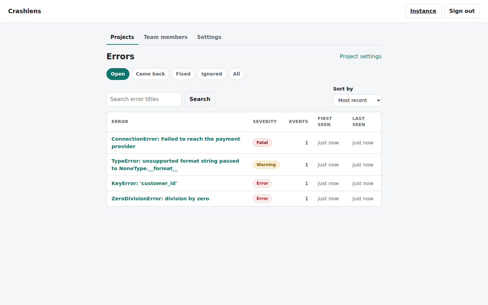
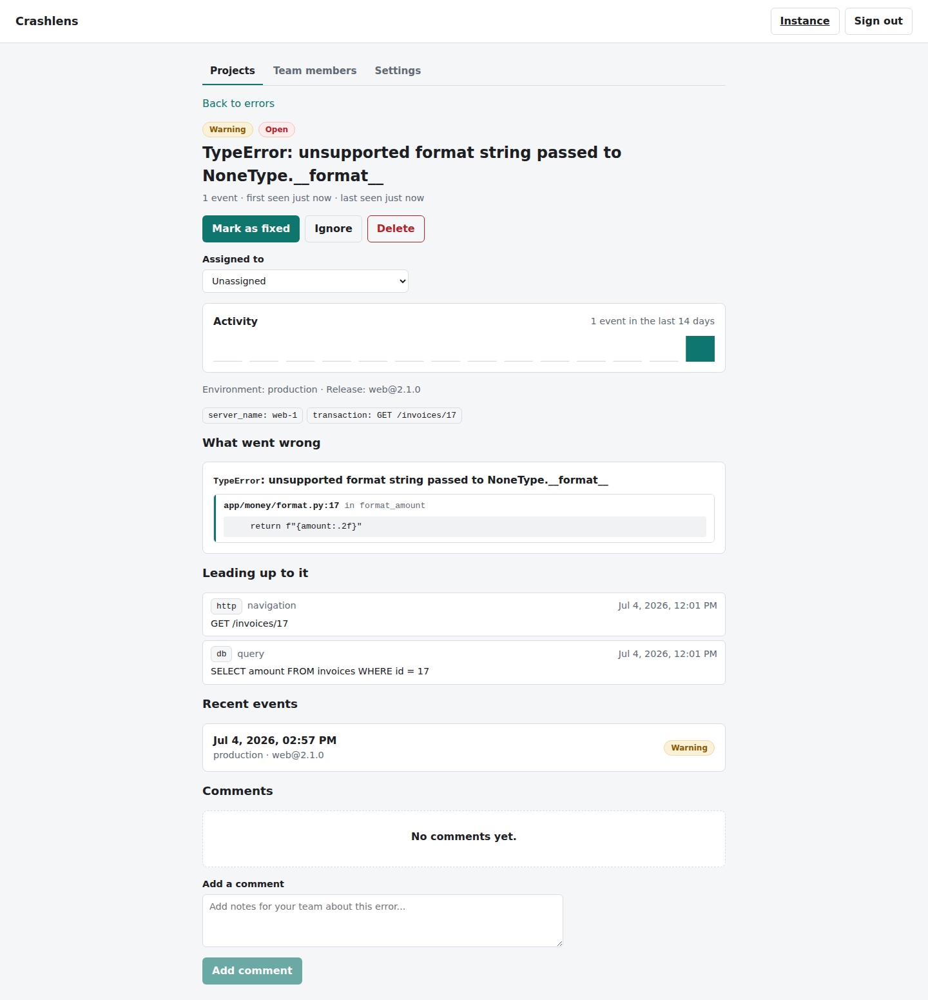
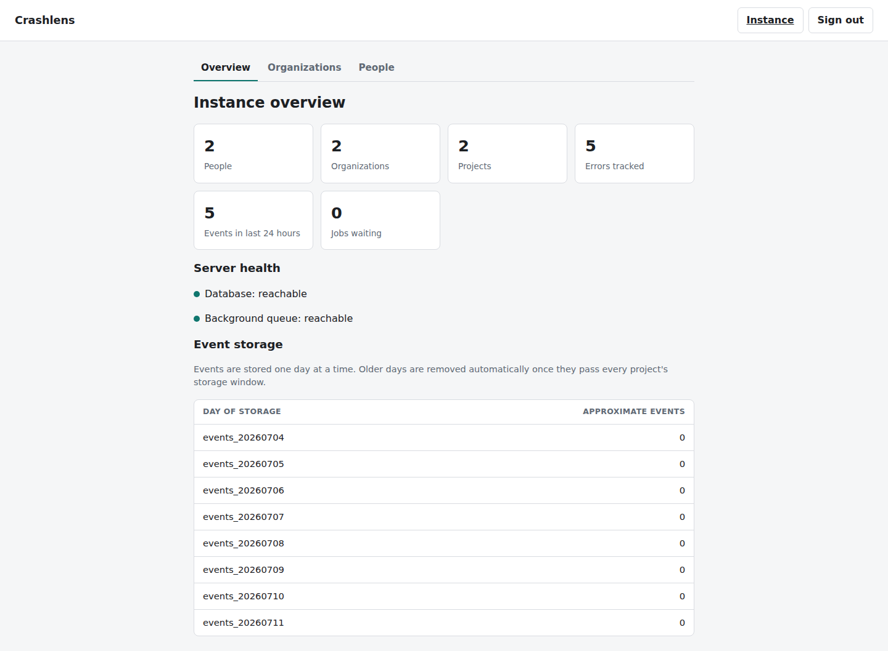

# Crashlens

Open source, self-hosted error monitoring for teams who want a Sentry-style
error tracker running on their own infrastructure.

Crashlens is a self hosted error monitoring and error tracking platform: add
one of the tiny client SDKs to your app, and unhandled exceptions are
captured, grouped into issues, and shown in a dashboard with stack traces,
breadcrumbs, releases, and occurrence trends so your team can find and fix
crashes fast. It is built for teams and solo developers who want the full
picture of production errors without sending application data to a third
party. Everything runs on your own servers, behind your own domain, under
your own control.

## Why Crashlens

- **Self-host first, not an afterthought.** One `docker compose up` brings up
  the reverse proxy, API, background worker, dashboard, Postgres, and Redis.
  There is no hosted-only tier and no telemetry phoning home.
- **Tiny, zero-dependency SDKs.** The Python, browser, and Node SDKs have no
  runtime dependencies, ship well under 5 KB where it matters (browser), and
  never throw into your application.
- **Real multi-tenant isolation.** Every organization's data is isolated at
  the database layer with PostgreSQL Row Level Security, not just an
  application-side `WHERE` clause.
- **Issues, not raw logs.** Events are fingerprinted and grouped into issues
  automatically, so a crash that fires a thousand times is one thing to
  triage, not a thousand.
- **Free and MIT licensed.** Read the code, change the code, run it forever
  without a per-seat bill.

## Quickstart

```bash
git clone https://github.com/hardik333-beep/crashlens.git
cd crashlens
cp .env.example .env   # then edit the placeholder values (see docs/configuration.md)

# Create the schema. Migrations are not run automatically, and they run as
# the schema-owning superuser (MIGRATIONS_DATABASE_URL), so load .env into
# your shell first.
set -a; . ./.env; set +a
docker compose run --rm -e DATABASE_URL=${MIGRATIONS_DATABASE_URL} api alembic upgrade head

docker compose up -d
```

This brings up six services: the Caddy reverse proxy (TLS termination and
static dashboard hosting), the FastAPI API, the arq background worker,
a one-shot dashboard build, Postgres, and Redis. Point your browser at the
host you configured (or `http://localhost` for a local trial) and sign up.
Signing up creates your account and your first organization, with you as its
admin; from there, create a project, generate a DSN key, and follow the
install snippet shown on the project page.

For a public deployment, set `CRASHLENS_SITE_ADDRESS` to your domain (for
example `crashlens.example.com`) before bringing the stack up, and Caddy
provisions HTTPS automatically. See [docs/self-hosting.md](docs/self-hosting.md)
for the full walkthrough, including updates and where your data lives.

## SDKs

Add one of the client SDKs to start sending errors. Each links to its own
README with the full install and configuration reference.

- **Python** - [sdks/python](sdks/python/README.md): plain Python, Flask,
  FastAPI/Starlette, and a `logging` handler.
  ```bash
  pip install -e sdks/python
  ```
- **Browser** - [sdks/browser](sdks/browser/README.md): a script tag or an
  npm/ESM import, under 4 KB gzipped.
  ```bash
  npm install @crashlens/browser
  ```
- **Node** - [sdks/node](sdks/node/README.md): plain Node or Express, zero
  runtime dependencies.
  ```bash
  npm install @crashlens/node
  ```

All three take the same DSN shape (`https://<public_key>@<host>/api/ingest/<project_id>/`,
copied from your project page) or an explicit `url` + `key` pair. See
[docs/sdks.md](docs/sdks.md) for a side-by-side comparison.

## Features

- **Issue grouping.** Events are fingerprinted server-side and grouped into
  issues, with occurrence counts and first-seen / last-seen timestamps.
- **Alerts.** Email, Slack, and generic webhook channels, scoped to an
  organization or a single project.
- **Releases and regression tracking.** Tag events with a release; a
  resolved issue that reappears in a later release is marked regressed.
- **Source maps.** Upload JavaScript source maps per release so browser
  stack traces show your original code, not minified output.
- **Per-project sampling.** Keep every event or keep a configured fraction,
  set independently for each project from the dashboard.
- **Team management.** Invite teammates by email, assign admin or member
  roles per organization, and manage everything from the same dashboard as
  the issues themselves.
- **Audit log.** Every sensitive organization action (invites, key
  creation/revocation, channel changes) is recorded with who did it and when.

## Architecture

Crashlens is a small set of plain, boring pieces. A FastAPI application
serves the API and accepts events on a single public ingest endpoint,
authenticated by a per-project DSN key; the payload is validated and handed
to Redis, and an arq background worker does the actual grouping, alerting,
and source map symbolication so the ingest path stays fast. Postgres is the
system of record, with events stored in daily range partitions so old data
ages out by dropping whole partitions instead of slow row-by-row deletes, and
every tenant table protected by PostgreSQL Row Level Security so one
organization's data is structurally invisible to another's queries. Caddy
sits in front of all of it: it terminates TLS, serves the compiled dashboard
as static files, and reverse-proxies API traffic.

## Screenshots

A full click-through tour, from signup to admin, is in
[docs/screenshots.md](docs/screenshots.md). Every image there is captured by the
end-to-end test suite on each run and committed back to the repository, so it is
always the real product. A few highlights:







## Repository layout

- `server/` - FastAPI application (API + background worker), Alembic
  migrations, tests.
- `dashboard/` - Vite + React + TypeScript dashboard, served as static files
  in production.
- `sdks/python/`, `sdks/browser/`, `sdks/node/` - client SDKs.
- `docs/` - protocol and operations documentation. See
  [docs/PROTOCOL.md](docs/PROTOCOL.md) for the ingest wire format.
- `deploy/` - `Caddyfile` and the per-service Dockerfiles referenced by
  `docker-compose.yml`.
- `scripts/` - operational helper scripts (backup, restore).

The `docker-compose.yml` and `.env.example` at the repository root are the
self-host entry point.

## Contributing

Issues and pull requests are welcome. Read
[docs/self-hosting.md](docs/self-hosting.md) to get a local instance running,
and [docs/PROTOCOL.md](docs/PROTOCOL.md) before touching the ingest path or an
SDK, since the wire format is frozen for v1 and any change there is a
compatibility break.

## License

MIT. See [LICENSE](LICENSE).

Built by [ScaleGrowth](https://scalegrowth.digital).
