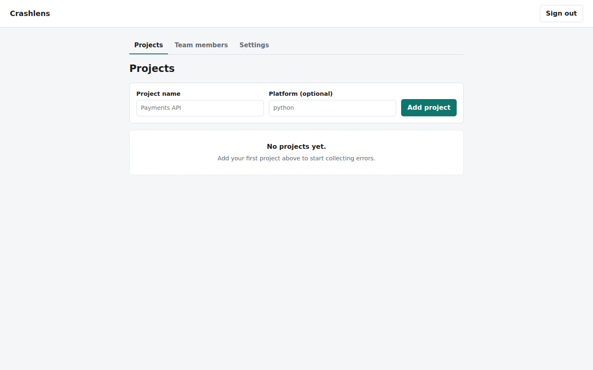
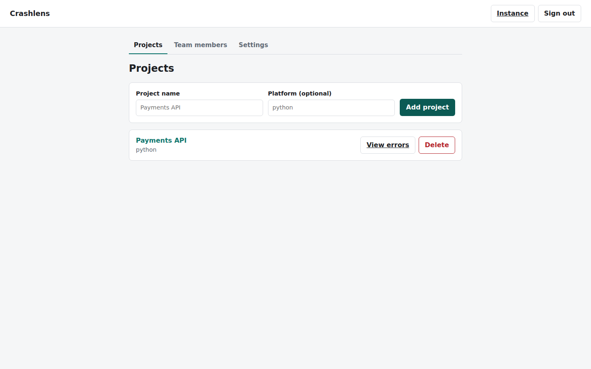
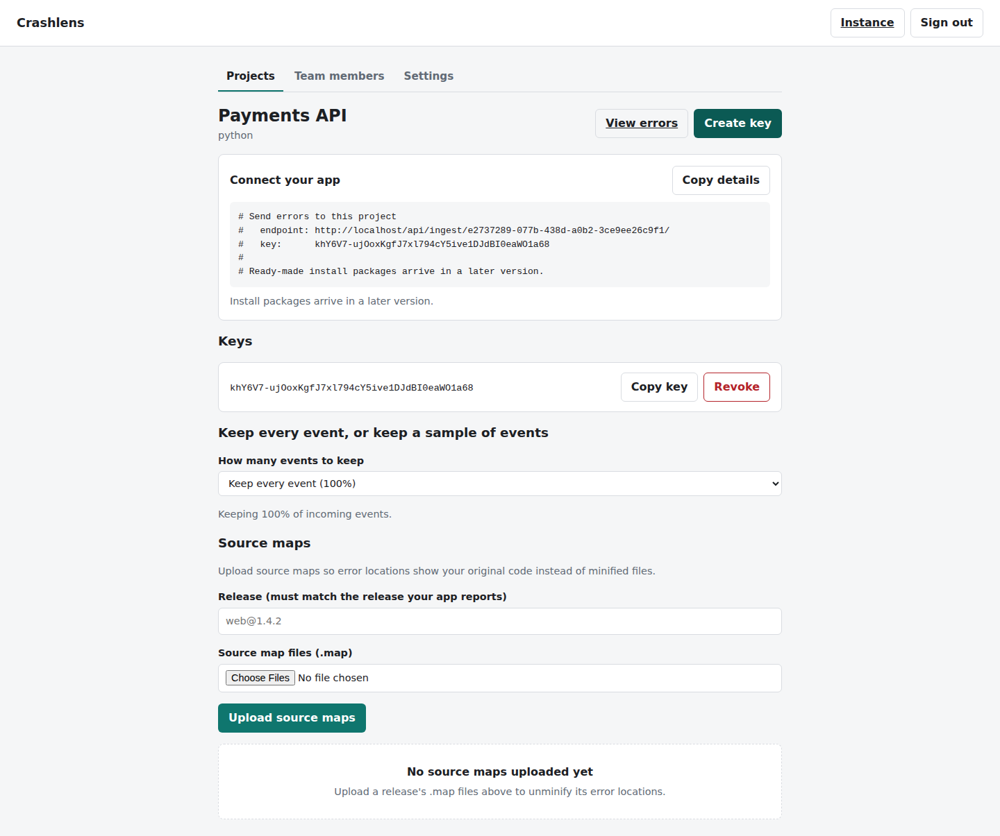
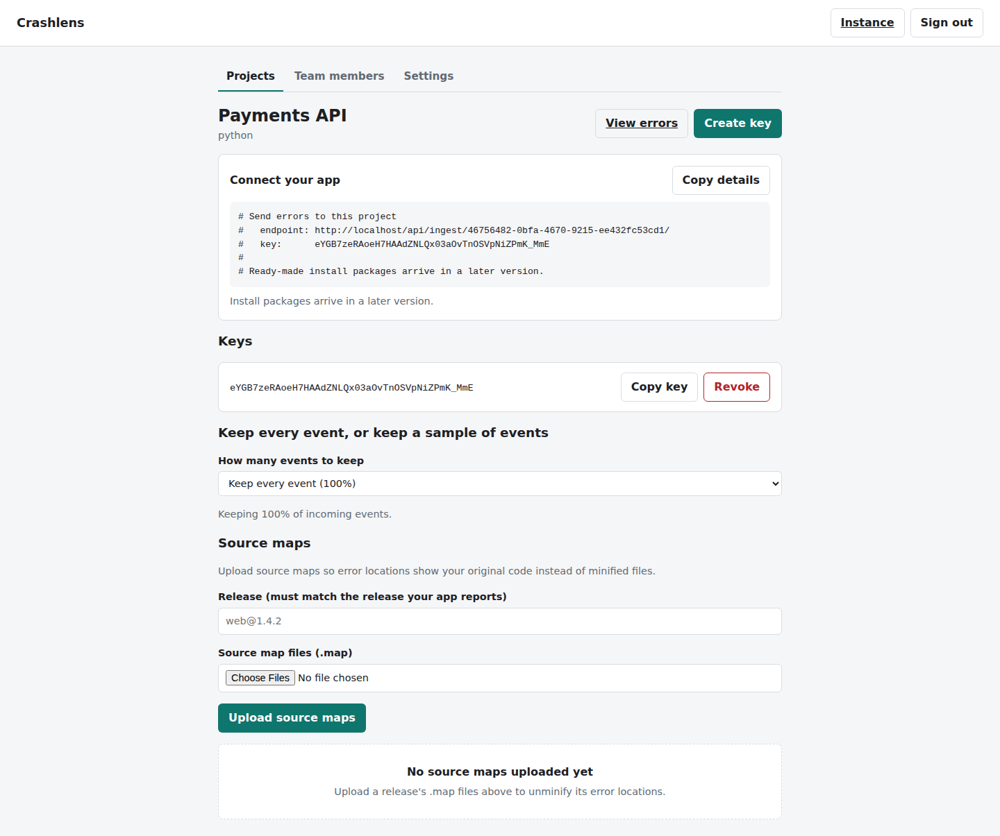
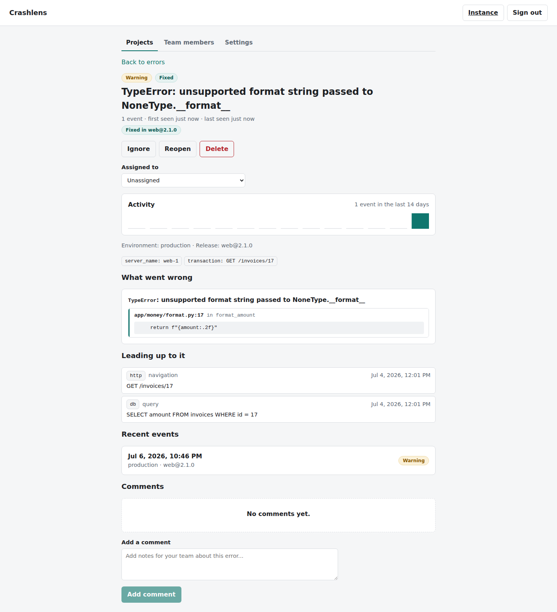
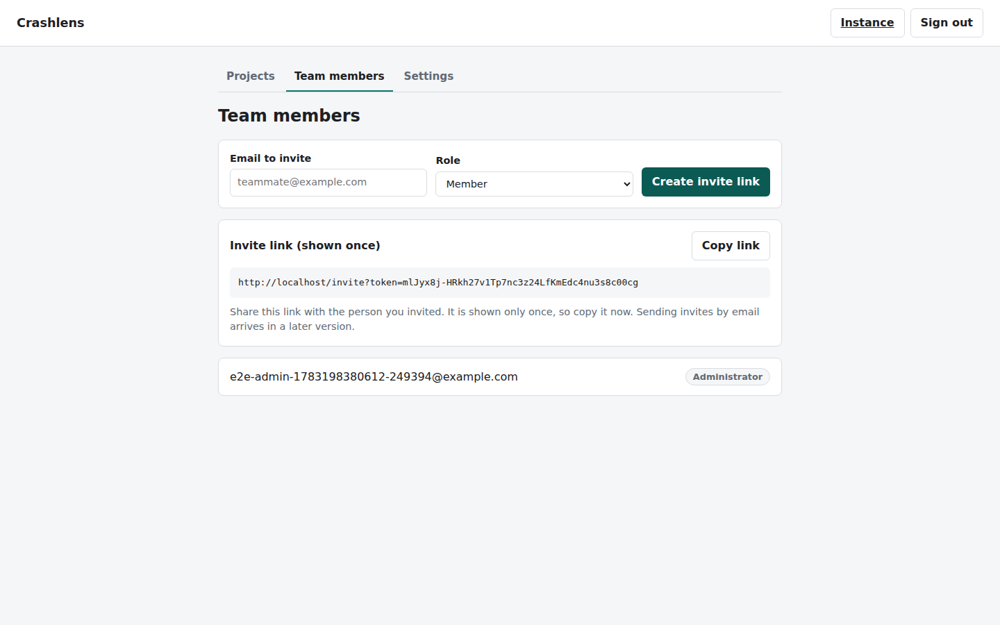
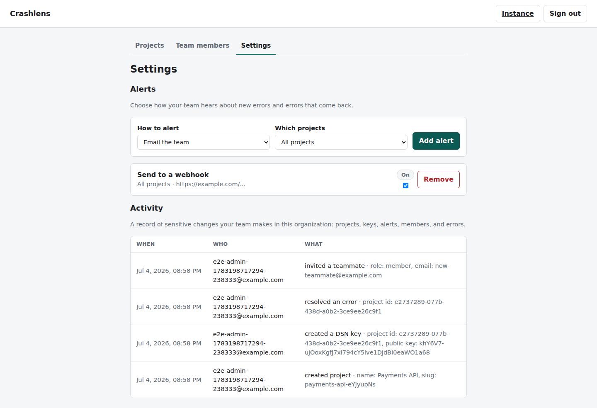
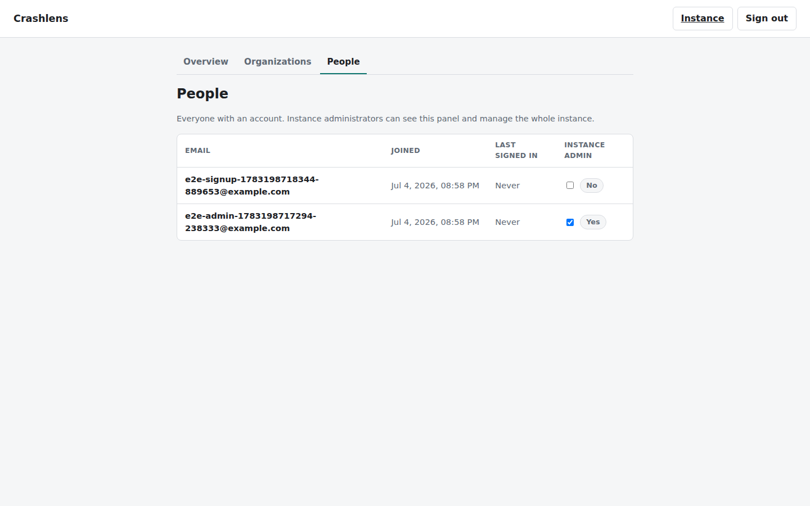
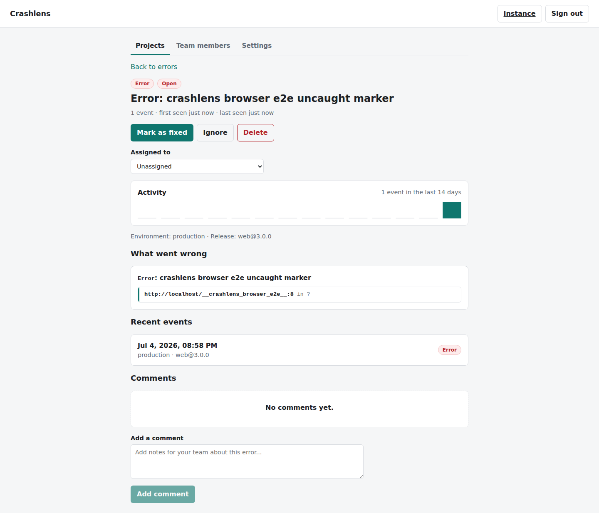

# A visual tour of Crashlens

This is a walkthrough of Crashlens in the order you would actually use it: sign
up, add a project, get a key, watch a real error arrive, triage it, set up
alerts, and look after the whole instance as its administrator.

Every image below is produced automatically by the end-to-end test suite on each
run and committed back to the repository, so what you see here is the real
product, not a mockup. If an image is missing, it lands on the next run of the
end-to-end job.

## 1. Create your account

You start by signing up. Your first account also creates your first team and
makes you its administrator.

## 2. Add a project

A project is one app you want to watch for errors. Here a project called
Payments API has just been added.

## 3. Get a key for your app

Each project gives you a key. Your app uses it to send its errors to Crashlens.
The key is shown with a one-click copy button and a ready-to-paste connection
snippet.

## 4. Decide how much to keep, and add source maps

For a busy app you can keep every error or just a share of them. You can also
upload source maps so browser errors show your original code instead of the
minified version.

## 5. See your errors

Once your app sends errors, they are grouped so a crash that happens a thousand
times is one thing to look at, not a thousand. You can filter and search the
list.

## 6. Dig into one error

Opening an error shows what went wrong: the full stack trace, the steps that led
up to it, the tags attached to it, and a small chart of how often it has been
happening.

## 7. Mark it fixed

When you have shipped a fix, mark the error as fixed. If it ever comes back in a
later release, Crashlens reopens it for you.

## 8. Invite your team

Bring teammates in by email. Each invite produces a one-time link you can share.

## 9. Set up alerts

Tell Crashlens where to shout when a new error shows up: email, Slack, or any
webhook. Every sensitive change is also written to an activity log you can
review.

## 10. Look after the whole instance

If you run the instance, an operator view shows how many people, teams, projects
and errors it holds, and whether the database and background queue are healthy.

## 11. Manage people

The people page lists everyone on the instance and lets you grant or remove
administrator access.

## 12. Errors from a real browser

This last shot is proof the whole path works end to end: a real browser SDK
caught an uncaught error, sent it through the public pipeline, and here it is
grouped in the dashboard.

